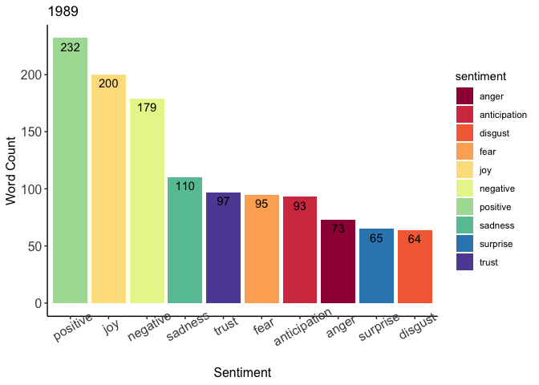

Sentiment Analysis
================

## 1. Introduction

This section of the project focuses on analyzing the sentiments conveyed
by Taylor Swift’s lyrics. Many of the concepts here are inspired by the
second chapter of the book *Text Mining with R: A Tidy Approach*, which
can be accessed [here](https://www.tidytextmining.com/sentiment.html). I
will be using three different lexicons, **Bing**, **NRC**, and
**AFINN**, to analyze the sentiment of Taylor’s music.

**Key Findings**:
- The Bing lexicon showed that her lyrics convey a more positive sentiment with words such as "like", "love", and "right" occuring frequently.
- Words that contributed most to the negative sentiment of her lyrics are "bad", "shake", and "break".
- The AFINN lexicon also showed that her lyrics convey a more positive sentiment with a positive mean AFINN value of 0.395.
- Both *folklore* and *evermore* have a negative mean AFINN value of -0.052 and -0.043, respectively, while *Red* had the highest mean AFINN value of 0.632.
- According to the NRC lexicon, the most common emotions conveyed by her lyrics are positive, negative, joy, and anticipation while the least common is disgust. This is generally consistent throughout her albums with some minor differences.

### 1.1 Loading Packages

These are the packages I used for this section of the project.

``` r
# Load required libraries
library(tidytext)
library(tidyverse)
library(ggplot2)
library(RColorBrewer)
library(gridExtra)
```

### 1.2 Importing Data

I imported and previewed the data from *swiftLyrics\_v2.csv*.

``` r
# Importing the data
df <- read.csv("data/swiftLyrics_v2.csv")

# Preview the data
head(df)
```

    ##   X Song Album                                        Lyric
    ## 1 1   22   Red                it feels like a perfect night
    ## 2 2   22   Red                    to dress up like hipsters
    ## 3 3   22   Red       and make fun of our exes  uh uh  uh uh
    ## 4 4   22   Red                it feels like a perfect night
    ## 5 5   22   Red                    for breakfast at midnight
    ## 6 6   22   Red to fall in love with strangers  uh uh  uh uh

### 1.3 Quick Data Preparation

I removed the extra column in the dataframe. I also performed some quick
data preparation with the data including changing the lyrics into a
character variable and parsing the lyrics into words and storing it into
a dataframe.

``` r
# Remove extra column "X"
df <- subset(df, select = -c(X))

# Change lyrics to character variable
df$Lyric <- as.character(df$Lyric)

# Turn strings of lyrics into words
words <- df %>% unnest_tokens(word,Lyric)

# Preview the words dataframe
head(words)
```

    ##   Song Album    word
    ## 1   22   Red      it
    ## 2   22   Red   feels
    ## 3   22   Red    like
    ## 4   22   Red       a
    ## 5   22   Red perfect
    ## 6   22   Red   night

### 1.4 Defining Variables

I defined vectors of colors and color palettes that match the aesthetics
of each album.

``` r
# Define vector of album titles
album.list <- factor(c("Taylor Swift", "Fearless", "Speak Now", "Red", "1989", "reputation", "Lover", "folklore", "evermore"))

# Define vector of color hex codes associated with each album aesthetic
colors = c("#366E84", "#D9C78F", "#462245", "#A02B48", "#CDC6AC", "#333333", "#CC6B96", "#BABABA", "#67230E")
```

## 2. Sentimental Analysis

### 2.1 Positive vs. Negative Sentiment using the Bing Lexicon

The **bing lexicon** categorizes words into positive or negative
categories.

``` r
# Obtain the bing lexicon sentiments
bing <- get_sentiments("bing")

# Join the sentiments with the words dataframe
words_bing <- words %>% inner_join(bing)

# Preview joined dataframe
head(words_bing, 5)
```

    ##   Song Album    word sentiment
    ## 1   22   Red    like  positive
    ## 2   22   Red perfect  positive
    ## 3   22   Red    like  positive
    ## 4   22   Red     fun  positive
    ## 5   22   Red    like  positive

``` r
# Count the words for each sentiment
bing_word_counts <- words_bing %>% count(word, sentiment, sort = TRUE)

# Obtain top 10 positive and negative words
pos.counts <- bing_word_counts[bing_word_counts$sentiment == "positive", ][1:10, ]
neg.counts <- bing_word_counts[bing_word_counts$sentiment == "negative", ][1:10, ]

# Plot the word counts of the positive words
p1 <- ggplot(pos.counts, aes(reorder(word, n), n)) + 
  xlab("Word") + ylab("Count") + ggtitle("Positive Words") + 
  geom_col(fill = "lawngreen") + 
  geom_text(aes(label = n), hjust = 1.2, color = "black") +
  coord_flip() + 
  theme_classic()

# Plot the word counts of the negative words
p2 <- ggplot(neg.counts, aes(reorder(word, n), n)) + 
  ylim(0, 100) + xlab("Word") + ylab("Count") + ggtitle("Negative Words") + 
  geom_col(fill = "indianred1") + 
  geom_text(aes(label = n), hjust = 1.2, color = "black") +
  coord_flip() + 
  theme_classic()

grid.arrange(p1, p2, ncol=2)
```

<!-- -->

According to the bing lexicon, words that contribute most to the
positive sentiment of Taylor Swift’s lyrics are **“like”**, **“love”**,
**“right”**, and **“good”**. Words that contribute most to the negative
sentiment are **“bad”**, **“shake”**, **“break”**, and **“fall”**. There
are significantly more occurrences of positive words than negatve words,
with the top 3 positive words occurring 389, 233, and 115 times while
the the top negative word occurs only 71 times.

It’s also interesting to note that the word **“shake”** appears the most
frequent in her song *Shake It Off*, which is a positive, empowering
song.

### 2.2 Positive vs. Negative Sentiment using the AFINN Lexicon

The **AFINN lexicon** is similar to the bing lexicon except words are
assigned a value between -5 and 5. Negative values indicate a negative
sentiment and positive values indicate a positive sentiment.

``` r
# Obtain the AFINN lexicon sentiments
afinn <- get_sentiments("afinn")

# Join the sentiments with the words dataframe
words_afinn <- words %>% inner_join(afinn)

# Preview joined dataframe
head(words_afinn)
```

    ##   Song Album    word value
    ## 1   22   Red    like     2
    ## 2   22   Red perfect     3
    ## 3   22   Red    like     2
    ## 4   22   Red     fun     4
    ## 5   22   Red    like     2
    ## 6   22   Red perfect     3

``` r
# Calculate mean
mean(words_afinn$value)
```

    ## [1] 0.3951881

``` r
# Plot the distribution of AFINN values in Taylor's music
ggplot(words_afinn, aes(value)) +
  geom_bar(fill = "darkgreen", color = "black") +
  xlab("AFINN Value") +
  ylab("Word Count") +
  ggtitle("AFINN Values of Taylor Swift's Lyrics") +
  theme_classic()
```

<!-- -->

Unsurprisingly, there are a lot more words with positive AFINN values in
Taylor’s lyrics than words with negative values with a mean AFINN value
of 0.395.

``` r
# Plot the distribution of AFINN values per album
for (i in 1:9) {
  p <- ggplot(words_afinn[words_afinn$Album == album.list[i], ], aes(value)) +
    geom_bar(fill = colors[i], color = "black") + 
    xlab("AFINN Value") + 
    ylab("Word Count") +
    ggtitle(album.list[i]) +
    theme_classic()
  
  print(p)
}
```


When it comes to individual albums, both *folklore* and *evermore* have
more words with negative AFINN values with mean values of -0.052 and
-0.043, respectively. Her most positive album is *Red* despite being an
album about tumultuous emotions. It has a mean AFINN value of 0.632.

``` r
# Calculate mean AFINN values per album
words_afinn %>% group_by(Album) %>% summarize(mean_afinn_value = mean(value))
```

    ## # A tibble: 9 × 2
    ##   Album        mean_afinn_value
    ##   <fct>                   <dbl>
    ## 1 1989                   0.5   
    ## 2 evermore              -0.0431
    ## 3 Fearless               0.515 
    ## 4 folklore              -0.0520
    ## 5 Lover                  0.482 
    ## 6 Red                    0.632 
    ## 7 reputation             0.452 
    ## 8 Speak Now              0.393 
    ## 9 Taylor Swift           0.546

## 2.3 Emotion Association with the NRC Lexicon

The **NRC lexicon** categorizes words in a binary fashion into
categories of positive, negative, anger, anticipation, disgust, fear,
joy, sadness, surprise, and trust.

``` r
# Obtain the NRC lexicon sentiments
nrc <- get_sentiments("nrc") 

# Join the sentiments with the words dataframe
words_nrc <- words %>% inner_join(nrc)

# Preview the joined dataframe
head(words_nrc, 5)
```

    ##   Song Album    word    sentiment
    ## 1   22   Red perfect anticipation
    ## 2   22   Red perfect          joy
    ## 3   22   Red perfect     positive
    ## 4   22   Red perfect        trust
    ## 5   22   Red     fun anticipation

``` r
# Count the words for each sentiment
nrc_word_counts <- words_nrc %>% count(sentiment, sort = TRUE)

# Plot the NRC sentiment word counts
ggplot(nrc_word_counts, aes(reorder(sentiment, -n), n)) + 
  geom_col(aes(fill = sentiment)) + 
  xlab("Sentiment") + 
  ylab("Word Count") + 
  ggtitle("NRC Sentiment") + 
  scale_fill_brewer(palette="Spectral") + 
  geom_text(aes(label = n), vjust = 1.5, color = "black") +
  theme_classic() +
  theme(axis.text=element_text(size=12), axis.title=element_text(size=12), axis.text.x = element_text(angle = 30))
```

<!-- -->

Accordng to the NRC lexicon, the most common emotions conveyed by
Taylor’s lyrics are **positive**, **negative**, **joy**, and
**anticipation**. The least common emotion is **disgust**.

``` r
# Get nrc sentiment word counts by album
nrc_album_word_counts <- words_nrc %>% count(Album, sentiment, sort = TRUE)

# Plot AFINN Score per album
for (i in 1:9) {
  p <- ggplot(nrc_album_word_counts[nrc_album_word_counts$Album == album.list[i], ], aes(reorder(sentiment, -n), n)) + 
    geom_col(aes(fill = sentiment)) + 
    xlab("Sentiment") + 
    ylab("Word Count") + 
    ggtitle(album.list[i]) + 
    scale_fill_brewer(palette="Spectral") + 
    geom_text(aes(label = n), vjust = 1.5, color = "black") +
    theme_classic() +
    theme(axis.text=element_text(size=12), axis.title=element_text(size=12), axis.text.x = element_text(angle = 30))
  
  print(p)
}
```



When it comes to individual albums, the most common and least common
emotions are generally consistent. There are, however, some slight
changes that occur in the order of the emotions:

1.  Words associated with **joy** are more common than **negative**
    words in the albums *Taylor Swift*, *1989*, and *Lover*.
2.  Words associated with **anticipation** are common in *Speak Now*,
    *folklore*, and *evermore*.
3.  Both *reputation* and *Lover* have more words associated with
    **disgust** than **surprise**.

## 3. Conclusion

This section focused on analyzing the sentiments conveyed by the lyrics
of Taylor Swift’s music using 3 different lexicons: bing, NRC, and
AFINN. Both the bing and AFINN lexicon showed that her lyrics have a
more positive sentiment than a negative sentiment. When it comes to
individual albums, however, *folklore* and *evermore* convey a more
negative sentiment.

The NRC lexicon associated words into 8 different emotions. Overall, the
most common emotions associated with her lyrics are positive, negative,
joy, and anticipation while the least common emotion is disgust. This
result generally stays consistent throughout her albums with some minor
changes.

However, these lexicons are not always correct in their interpretation.
For example, the song *Shake It Off* is full of negative words such as
“shake”, “hate”, “break” despite being an upbeat, positive song. Her
album *Red* is considered the most positive album based on the AFINN
lexicon despite being an album about tumultuous emotions. Despite this,
these lexicons are mostly correct in categorizing the sentiment of
Taylor’s music.

Although it is known that Taylor Swift tends to write music about love,
heartbreak, and relationships, this analysis shows that she tends to
write in a more positive perspective about these topics. This
contradicts the fairly common idea that she only writes songs to get
back at her exes. I think it would be interesting to see how the Spotify
feature “valence”, which represents the musical positiveness conveyed by
the track, is associated with these sentiments. It would also be
interesting to see what emotions are associated with popular songs and
see if this extends to music in general. For example, one can look at
the sentiments of songs in the Billboard Hot 100 every week and
determine if there is a pattern in the sentiments throughout the year.
These sentiments have the potential to determine what emotions people
are feeling based on the music they listen to.
