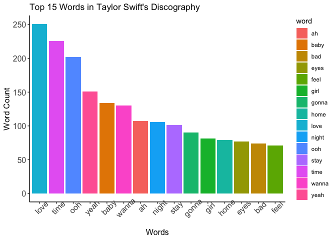
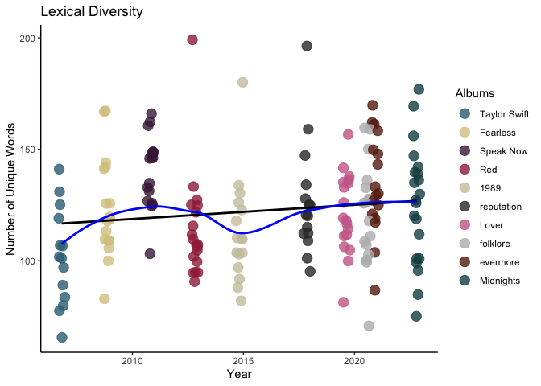
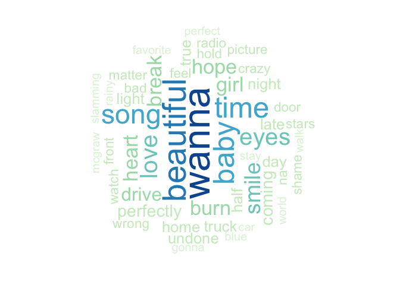
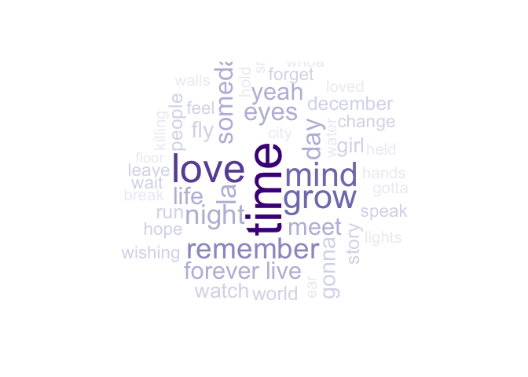
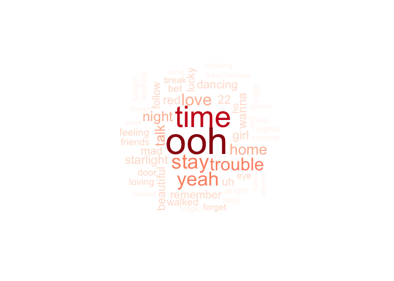
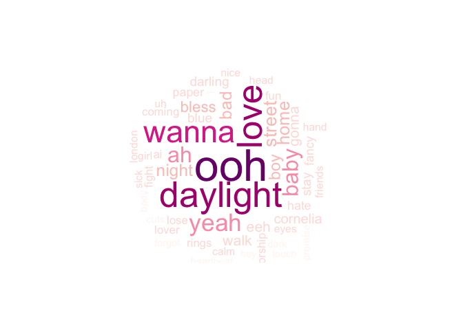
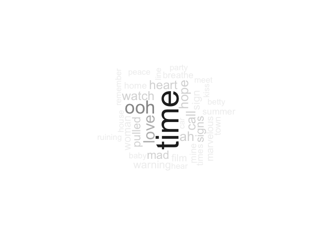
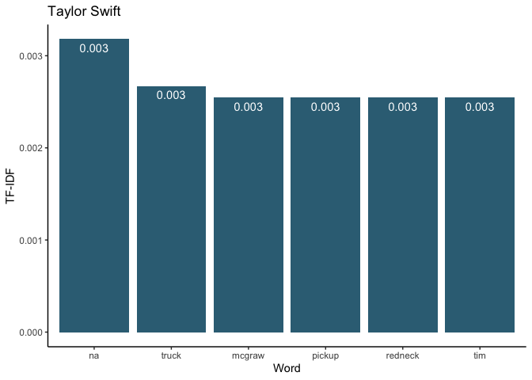
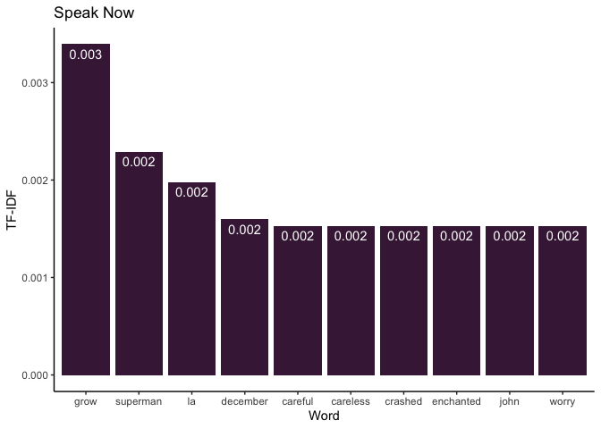
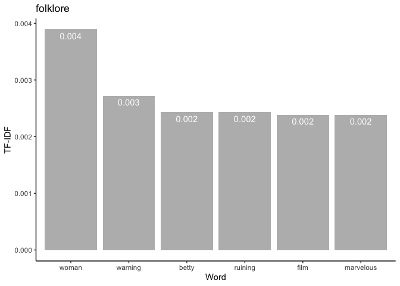

Word Count Analysis
================

## 1. Introduction

This section of the project focuses on exploring Taylor Swift’s lyrics
based on word frequency. I also looked at the **lexical diversity** of
her music over time, which measures how the vocabulary varies in her
music. Finally, I calculated the **Term Frequency - Inverse Document
Frequency**, or **TF-IDF**, to determine any key words in her lyrics
that could describe the themes of her albums.

**Key Findings**:
- The most common words that Taylor Swift uses in her lyrics are "love", "time", and "baby". Musical sound effects such as "ooh" and "la" are also very common. "Time" is the most common word in 4 of her albums.
- Words are repeated much more often in her poppier albums, *Red*, *1989*, *reputation*, and *Lover*.
- There is un upward trend in lexical diversity with her first 3 albums. This started to decrease when she began transitioning to pop music with her 4th album, *Red*. Starting with *reputation*, there has been an upward trend in lexical diversity.
- The words "grow", "trouble", and "daylight" describe the themes of the albums *Speak Now*, *Red*, and *Lover* the best based on their TF-IDF values.

### 1.1 Loading Packages

These are the packages I used for this section of the project.

``` r
# Load required libraries
library(tidytext)
library(tidyverse)
library(wordcloud)
library(ggplot2)
library(RColorBrewer)
library(gridExtra)
```

### 1.2 Importing Data

I imported the data from *swiftLyrics_v2.csv* to a dataframe. Since
there was an extra column in the dataframe, I removed it.

``` r
# Importing the data
df <- read.csv("data/swiftLyrics_v2.csv")

# Preview the data
head(df)
```

    ##   X Song Album                                        Lyric
    ## 1 1   22   Red                it feels like a perfect night
    ## 2 2   22   Red                    to dress up like hipsters
    ## 3 3   22   Red       and make fun of our exes  uh uh  uh uh
    ## 4 4   22   Red                it feels like a perfect night
    ## 5 5   22   Red                    for breakfast at midnight
    ## 6 6   22   Red to fall in love with strangers  uh uh  uh uh

``` r
# Remove extra column "X"
df <- subset(df, select = -c(X))

# Change lyrics to character variable
df$Lyric <- as.character(df$Lyric)
```

### 1.3 Defining Variables

I defined vectors of album titles, colors hex codes, and color palettes
associated with each album aesthetic that I will be using in some of the
visualizations.

``` r
# Create a vector of the album titles
album.list <- factor(c("Taylor Swift", "Fearless", "Speak Now", "Red", "1989", "reputation", "Lover", "folklore", "evermore"))

# Create a vector of color palettes associated with each album aesthetic
palette = c("GnBu", "YlOrBr", "Purples", "Reds", "YlGnBu", "Greens", "RdPu", "Greys", "OrRd")

# Create a vector of color codes associated with each album aesthetic
colors = c("#366E84", "#D9C78F", "#462245", "#A02B48", "#CDC6AC", "#333333", "#CC6B96", "#BABABA", "#67230E")
```

## 2. Lyrics Exploration

### 2.1 Word Cloud

I parsed Taylor’s lyrics into words and their frequencies. I removed the
**stop words**, which are a set of words that are common and
uninformative (e.g. “the”, “and”, etc.), from the dataset. I used a word
cloud to visualize the word counts because it can easily convey the
topics of Taylor’s music.

``` r
# Separate strings into words
words = df %>% unnest_tokens(word,Lyric)

# Obtain word counts
word.count <- words %>% count(word, sort = TRUE)

# Remove stop words
word.count <- word.count %>% anti_join(stop_words)
```

``` r
# Create word cloud
wordcloud(words = word.count$word, 
          freq = word.count$n, 
          min.freq = 1,
          max.words = 200,
          random.order = FALSE,
          rot.per = 0.35, 
          colors = brewer.pal(8, "Dark2"))
```

<!-- -->

The words **“love”**, **“time”**, and **“baby”** are some of the most
frequenct words in Taylor’s music, as seen by the large size of the
these words in the word cloud. Most of her music are about love and
relationships, so it’s no surprise that these words appear in her lyrics
quite frequently.

The word **“ooh”** is also frequent in her lyrics, but this word is
commonly used as a musical effect and doesn’t really mean anything
significant in the English language.

### 2.2 Word Frequency Plot

For a more informative visual, I plotted the top 15 most frequent words.
The word **“love”** appears 233 times, followed by **“time”** which
appears 203 times.

``` r
# Bar plot of word counts
ggplot(data = word.count[1:15,], aes(x = reorder(word, -n), y = n)) + 
    geom_bar(stat = "identity", aes(fill = word)) + 
    ggtitle("Top 15 Words in Taylor Swift's Discography") +
    ylab("Word Count") + 
    xlab("Words") + 
    theme_classic() +
    theme(axis.text=element_text(size=12), axis.title=element_text(size=12), axis.text.x = element_text(angle = 45))
```

<!-- -->

``` r
# View the top 5 most common words
word.count[1:5, ]
```

    ##   word   n
    ## 1 love 233
    ## 2 time 203
    ## 3  ooh 195
    ## 4 baby 131
    ## 5 yeah 130

### 2.3 Lexical Diversity

I wanted to determine how many unique words are used in each of Taylor’s
songs to see if her vocabulary has gotten more diverse throughout the
years. Using a
[tutorial](https://www.datacamp.com/community/tutorials/R-nlp-machine-learning)
from *DataCamp*, I was able to plot the lexical diversity of Taylor’s
music over time.

However, I first need to add the release dates of her albums in a new
column called **release_date**.

``` r
# Create a vector of release dates
dates <- c("2006-10-24", "2008-11-11", "2010-10-25", "2012-10-22", "2014-10-27",
                   "2017-11-10", "2019-08-23", "2020-07-24", "2020-12-11")

# Create empty release_date column
df$release_date <- NA

# Iterate through the dataframe to add the release date to the corresponding album 
for (i in 1:9) {
  df[df$Album == album.list[i], "release_date"] = dates[i]
}

# Change release date to a Date type
df$release_date <- as.Date(df$release_date)
```

``` r
# Obtain lexical diversity
lex_diversity <- df %>% 
  unnest_tokens(word, Lyric) %>% 
  group_by(release_date, Song) %>% 
  summarise(lex_diversity = n_distinct(word)) %>%
  arrange(desc(lex_diversity))

# Plot lexical diversity
diversity_plot <- lex_diversity %>%
  ggplot(aes(release_date, lex_diversity)) +
  geom_point(aes(color = factor(release_date)),
             alpha = 0.8, 
             size = 4, 
             position = "jitter") + 
  scale_color_manual(values = colors, name = "Albums", labels = album.list) + 
  stat_smooth(color = "black", se = FALSE, method = "lm") +
  geom_smooth(aes(x = release_date, y = lex_diversity), se = FALSE,
              color = "blue", lwd = 1) +
  ggtitle("Lexical Diversity") +
  ylab("Number of Unique Words") + 
  xlab("Year") + 
  theme_classic()

diversity_plot
```

<!-- -->

``` r
# View highest and lowest lexical diversity values
head(lex_diversity, 1)
```

    ## # A tibble: 1 × 3
    ## # Groups:   release_date [1]
    ##   release_date Song         lex_diversity
    ##   <date>       <fct>                <int>
    ## 1 2012-10-22   All Too Well           199

``` r
tail(lex_diversity, 1)
```

    ## # A tibble: 1 × 3
    ## # Groups:   release_date [1]
    ##   release_date Song                   lex_diversity
    ##   <date>       <fct>                          <int>
    ## 1 2006-10-24   A Perfectly Good Heart            66

As shown by the plot, Taylor’s lyrical diversity has increased since her
first album in 2006. However, there was a decrease in lexical diversity
when she transitioned into pop music starting with her 4th album *Red*
in 2012. There has been a slight upward trend since 2017 starting with
her 6th album *reputation*.

Her most lyrically diverse song is *All Too Well* with 199 unique words,
while her least lyrically diverse song is *A Perfectly Good Heart* with
66 unique words. Many critics and fans consider *All Too Well* to be
Taylor’s best song due to its storytelling.

## 3. Lyrics Exploration by Album

### 3.1 Word Cloud by Album

I turned the procedure that I used in section 2.1 to parse the lyrics
into word counts into a function. Then, I iterated through the album
list to subset the data by album and produce a word cloud for each
album.

``` r
# Define word cloud function
get.word.cloud <- function(df, palette) {
  
  # Get words
  words = df %>% unnest_tokens(word,Lyric)
  
  # Get word count
  word.count <- words %>% count(word, sort = TRUE)
  
  # Remove stop words
  word.count <- word.count %>% anti_join(stop_words)
  
  # Get word cloud
  wordcloud(words = word.count$word,
            freq = word.count$n,
            min.freq = 3,
            max.words = 50,
            random.order = FALSE, 
            rot.per = 0.35, 
            colors = brewer.pal(8, palette))
}
```

``` r
# Apply function for each album
for (i in 1:9) {
  get.word.cloud(df[df$Album == album.list[i],], palette[i])
}
```



The first thing I noticed is that the word clouds for *1989* and
*folklore* are smaller compared to the rest. This may be due to the fact
that the most frequent words are significantly higher than the rest of
the words in the album.

For *Fearless*, *Red*, *reputation*, *Lover*, and *evermore*, the most
common words are either **“la”**, **“ooh”**, or **“di”**, which are
musical effects rather than actual words. Her self-titled album appears
to have the least amount of these words. Both *Speak Now* and *folklore*
have **“time”** as the most frequent word.

### 3.2 Word Frequency by Album

I did the same thing as in 3.1 with the word frequency bar plots.

``` r
# Define bar plot function
get.bar.plot <- function(df, color) {
  # Get words
  words = df %>% unnest_tokens(word,Lyric)
  
  # Get word count
  word.count <- words %>% count(word, sort = TRUE)
  
  # Remove stop words
  word.count <- word.count %>% anti_join(stop_words)
  
  # Get bar plot
  p <- ggplot(data = word.count[1:15,], aes(x = reorder(word, -n), y = n)) + 
    geom_bar(stat = "identity", fill = color) + 
    ggtitle(df$Album) +
    ylab("Word Count") + 
    xlab("Words") + 
    theme_classic() +
    theme(axis.text=element_text(size=12), axis.title=element_text(size=12), axis.text.x = element_text(angle = 45)) + 
    geom_text(aes(label = n), vjust = 1.5, color = "white")
  print(p)
}
```

``` r
# Apply bar plot function to each album
for (i in 1:9) {
  get.bar.plot(df[df$Album == album.list[i],], colors[i])
}
```


When excluding meaningless words such as “ooh”, “la”, etc., the most
common words in each album are:

1.  *Taylor Swift* - “wanna”, “beautiful”, “baby”
2.  *Fearless* - “time”, “baby”, “fall”
3.  *Speak Now* - “time”, “love”, “grow”
4.  *Red* - “time”, “stay”, “yeah”
5.  *1989* - “love”, “shake”, “baby”
6.  *reputation* - “baby”, “wanna”, “time”
7.  *Lover* - “daylight”, “love”, “wanna”
8.  *folklore* - “time”, “love”, “call”
9.  *evermore* - “left”, “time”, “love”

Word such as **“time”**, **“love”**, and **“baby”** appear frequently in
all her albums. Interestingly enough, **“time”** is the most frequent
word in 4 of her albums, but **“love”** is more frequent when it comes
to her overall lyrics, as seen by the word cloud in section 2.1.

The repetition of words are highest with *1989*, *Red*, *reputation*,
and *Lover* (her pop albums) with words counts from the 50s to the 80s.
It is lowest with her self-titled album, where the most frequent word
occurs less than 20 times.

Some of the words are hevily influenced by a single song such as
**“stay”** with *Stay Stay Stay* and **“shake”** with *Shake It Off*.

### 3.3 TF-IDF

Since the most frequent words in each of her albums are not that much
different from each other, I wanted to see if there is a word that can
decribe a particular album the most within the lyrics of that album. By
calculating the **TF-IDF**, I can see the importance of the words and
assign a key word for each album.

``` r
# Get word counts
word.count <- words %>% count(Album, word, sort = TRUE)

# Calculate TF-IDF
tf.idf <- bind_tf_idf(word.count, word, Album, n)

# View TF-IDF dataframe
head(tf.idf)
```

    ##        Album word   n         tf idf tf_idf
    ## 1      Lover    i 459 0.07419981   0      0
    ## 2 reputation    i 355 0.05544276   0      0
    ## 3   Fearless    i 348 0.06521739   0      0
    ## 4  Speak Now  you 347 0.05754561   0      0
    ## 5       1989    i 343 0.05852244   0      0
    ## 6   Fearless  you 340 0.06371814   0      0

``` r
# Obtain top 5 highest TF-IDF for each album
top.tf.idf <- tf.idf %>% group_by(Album) %>% top_n(5, tf_idf)

# Plot the top 5 highest TF-IDF values per album
for (i in 1:9) {
  p <- ggplot(top.tf.idf[top.tf.idf$Album == album.list[i], ], 
         aes(x = reorder(word, -tf_idf), y = tf_idf)) + 
  geom_bar(stat = "identity", fill = colors[i]) + 
  xlab("Word") + 
  ylab("TF-IDF") +
  ggtitle(album.list[i]) +
  theme_classic()
  
  print(p)
}
```



The words with the highest TF-IDF value for *Speak Now* (**“grow”**),
*Red* (**“trouble”**), and *Lover* (**“daylight”**) capture the themes
of their corresponding album the most. For words within the top 5,
**“princess”** and **“getaway”** captures the themes of *Fearless* and
*reputation*, respectively.

In my opinion, none of the words within the top 5 highest TF-IDF score
can sufficiently decribe the themes of her albums *Taylor Swift*,
*1989*, *folklore*, and *evermore*.

## 4. Conclusion

This section focused on analyzing the word frequencies of Taylor Swift’s
lyrics. Some of the most common words she uses in her lyrics are
**“love”**, **“time”**, and **“baby”**. Although these results were
expected as she often writes about love and relationships, it was still
interesting to look at it from a quantitative perspective.

Musical sound effects such as **“ooh”** and **“la”** were also common.
The sound effect **“di”** appears 54 times from a single song: *I Did
Something Bad*. Words are repeated more often in her poppier albums,
*Red*, *1989*, *reputation*, and *Lover*, compared to her country and
alternative albums. The words **“grow”**, **“trouble”**, and
**“daylight”** describe the themes of the albums *Speak Now*, *Red*, and
*Lover*, respectively, based on their TF-IDF values.

When it comes to lexical diversity, her vocabulary began to vary more since
her first album in 2006 but decreased when she transitioned into pop
music. Since her 6th album, *reputation* (2017), there has been an
upward trend in lexical diversity.

Time of the day was a common theme in Swift’s lyrics, with words such as
**“night”**, **“day”**, and **“daylight”** appearing frequently
throughout her albums. I think it would be interesting to see how
frequent a specific theme of words (e.g., colors) appears in her lyrics.
It would also be interesting to see how other features of her music,
such as the Spotify features, are associated with these results. For
example, is there a relationship between a song’s popularity and lexical
diversity? Merging the Spotify features with the lyrics dataset could
lead into more insights to her music.
